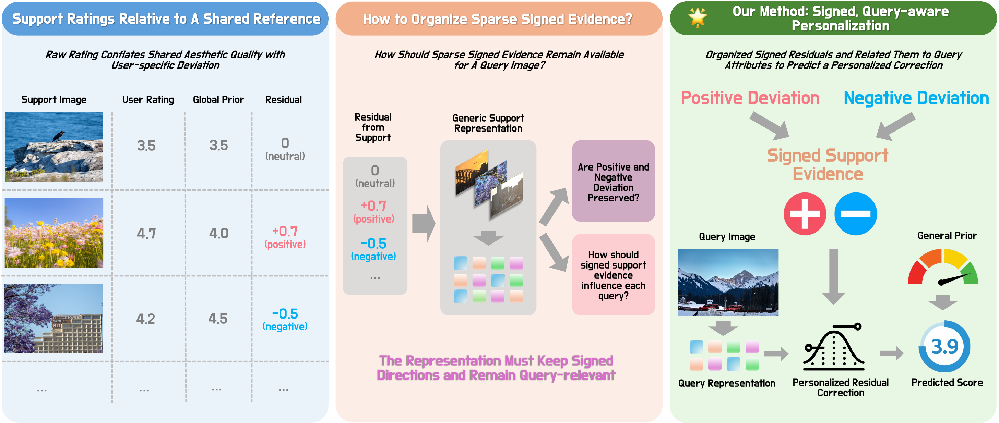
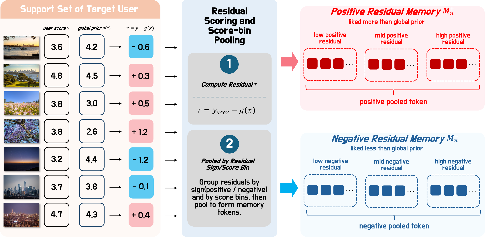
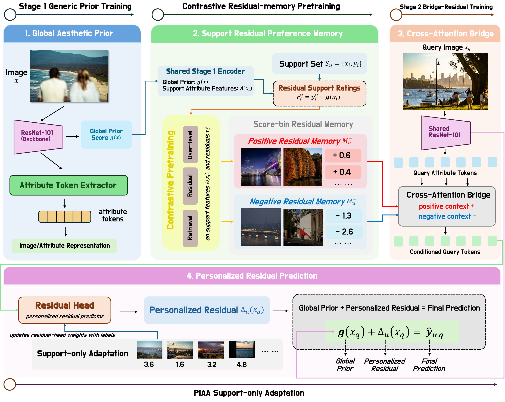

# CABRIA

CABRIA is a personalized image aesthetic assessment (PIAA) framework based on
support-conditioned residual preference memory. The codebase contains the
training and evaluation pipeline for a shared aesthetic prior, dataset-specific
contrast pretraining, Stage 2 bridge-residual initialization, and per-user PIAA
support-only adaptation.

## Motivation

Raw user ratings mix two factors: image-level aesthetic quality shared across
users and user-specific deviation from that shared reference. CABRIA models the
user-specific part as a signed residual, then keeps positive and negative
support evidence available for query-aware personalization.



[PDF version](assets/figures/motivation_user_residuals.pdf)

## Support Residual Preference Memory

For each support image, CABRIA computes the residual between the user rating and
the global prior prediction. Support residuals are grouped by sign and score bin
to form positive and negative memory tokens for each user.



[PDF version](assets/figures/support_residual_conditioned_preference_memory.pdf)

## Method Overview

The full pipeline has four stages:

1. Stage 1 trains a general aesthetic prior.
2. Contrast pretraining learns residual preference memory from support examples.
3. Stage 2 trains the bridge-residual initializer.
4. PIAA adapts on each target user's support set and predicts personalized query scores.



[PDF version](assets/figures/architecture.pdf)

## Repository Layout

```text
configs/                 Data, Stage 1, Contrast, Stage 2, and PIAA configs
scripts/                 Training, split preparation, and inference entrypoints
src/cobra/               Python package
assets/figures/          README figures and source PDFs
requirements.txt         Python dependencies
```

Generated data, checkpoints, logs, downloaded backbones, archives, and local
environment files are intentionally excluded from this release.

## Environment

Install dependencies:

```bash
python -m pip install -r requirements.txt
```

Set the package path:

```bash
export PYTHONPATH=src
```

On Windows PowerShell:

```powershell
$env:PYTHONPATH = "src"
```

## Data And Paths

Dataset files and training artifacts are not included. Update config paths before
running experiments. Public release configs use placeholders such as:

```text
/path/to/datasets/FLICKR-AES-001
/path/to/datasets/PARA
/path/to/datasets/LAPIS
/path/to/outputs
/path/to/checkpoints/best_stage1.pt
```

## Main Configs

| Dataset | Data config | Contrast | Stage 2 | PIAA |
|---|---|---|---|---|
| Flickr-AES | `configs/data_flickr_aes_user_heldout_remote.yaml` | `configs/stage1_contrast_flickr_userheldout_reference_resnet101.yaml` | `configs/stage2_flickr_userheldout_reference_resnet101.yaml` | `configs/piaa_bridge_userheldout_reference_stage2init_supportensemble_resnet101.yaml` |
| PARA | `configs/data_para_user_heldout_relative.yaml` | `configs/stage1_contrast_para_userheldout_reference_resnet101.yaml` | `configs/stage2_para_userheldout_reference_resnet101.yaml` | `configs/piaa_bridge_para_userheldout_reference_stage2init_supportensemble_resnet101.yaml` |
| LAPIS | `configs/data_lapis_user_heldout.yaml` | `configs/stage1_contrast_lapis_userheldout_reference_resnet101.yaml` | `configs/stage2_lapis_userheldout_reference_resnet101.yaml` | `configs/piaa_bridge_lapis_userheldout_reference_stage2init_supportensemble_resnet101.yaml` |
| REAL-CUR | `configs/data_realcur_userheldout_10_2_2.yaml` | `configs/stage1_contrast_realcur_userheldout_10_2_2_resnet101.yaml` | `configs/stage2_realcur_userheldout_10_2_2_reference_resnet101.yaml` | `configs/piaa_bridge_realcur_userheldout_10_2_2_reference_stage2init_supportensemble_resnet101.yaml` |

Shared Stage 1:

```text
configs/stage1_giaa_flickr_para_lapis_prior17337_resnet101.yaml
configs/data_stage1_flickr_prior17337.yaml
```

## Minimal Commands

Prepare user splits:

```bash
python scripts/prepare_user_splits.py \
  --data-config configs/data_para_user_heldout_relative.yaml
```

Train Stage 1:

```bash
CUDA_VISIBLE_DEVICES=0 python scripts/train_stage1.py \
  --config configs/stage1_giaa_flickr_para_lapis_prior17337_resnet101.yaml \
  --data-config configs/data_stage1_flickr_prior17337.yaml
```

Train dataset-specific Contrast:

```bash
CUDA_VISIBLE_DEVICES=0 python scripts/train_stage1_contrast.py \
  --config configs/stage1_contrast_para_userheldout_reference_resnet101.yaml \
  --data-config configs/data_para_user_heldout_relative.yaml
```

Train dataset-specific Stage 2:

```bash
CUDA_VISIBLE_DEVICES=0 python scripts/train_stage2.py \
  --config configs/stage2_para_userheldout_reference_resnet101.yaml \
  --data-config configs/data_para_user_heldout_relative.yaml \
  --support-sizes 100
```

Run PIAA evaluation:

```bash
CUDA_VISIBLE_DEVICES=0 python scripts/train_bridge_piaa.py \
  --config configs/piaa_bridge_para_userheldout_reference_stage2init_supportensemble_resnet101.yaml \
  --data-config configs/data_para_user_heldout_relative.yaml \
  --support-sizes 10 100 \
  --repeats 10 \
  --user-source split
```

For Flickr-AES, use `--user-source user_heldout`. For PARA, LAPIS, and
REAL-CUR, use `--user-source split`.

## Inference

```bash
python scripts/infer.py \
  --config configs/stage2_para_userheldout_reference_resnet101.yaml \
  --stage2-checkpoint /path/to/checkpoints/best_stage2_multishot.pt \
  --support-images /path/to/support_1.jpg /path/to/support_2.jpg \
  --support-scores 4.0 2.5 \
  --query-image /path/to/query.jpg
```

## Release Notes

- Checkpoints, logs, datasets, local backbone caches, and experiment artifacts are not included.
- Config files use `/path/to/...` placeholders for machine-specific paths.
- Experiment tracking integrations are not included in this public release.
